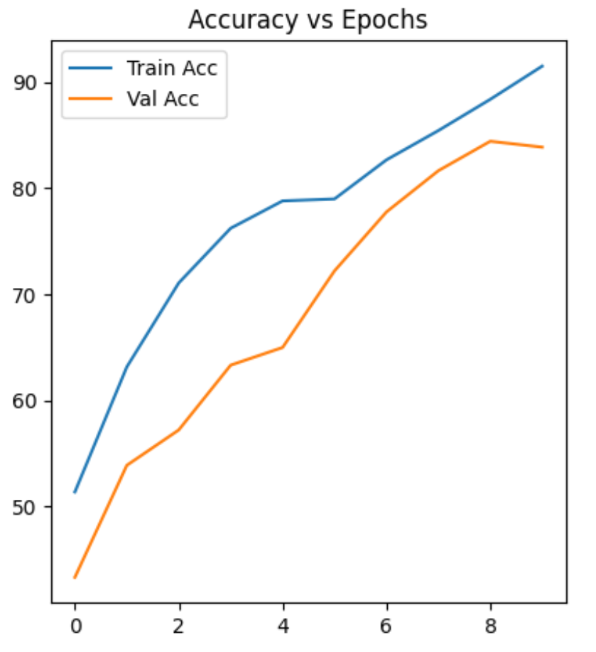
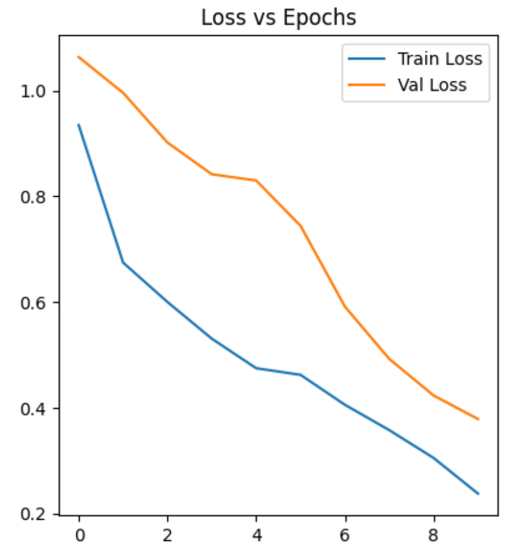
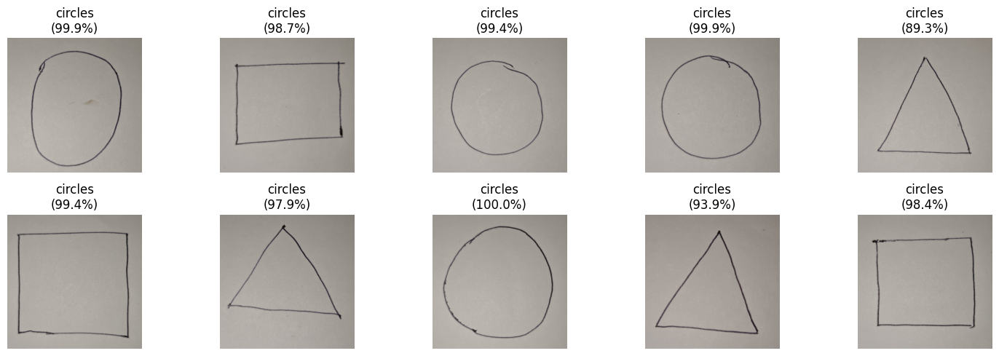
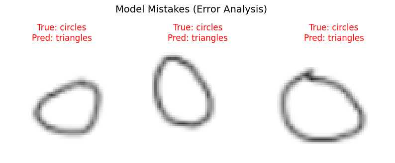

# Geometric Shapes Classification with CNN

## 📌 Project Overview
This project implements a Convolutional Neural Network (CNN) using PyTorch to classify geometric shapes (**Circles, Squares, Triangles**). The pipeline bridges standard dataset training with real-world testing, fulfilling the requirements for Assignment 6.

The project features:
1.  **Automated Pipeline:** Automatically clones data and trains the model in Google Colab.
2.  **Custom Data Integration:** Tests the model on real-world photos taken with a smartphone.
3.  **Visual Analysis:** Includes training plots, confusion matrices, and error analysis.

---

## 🏗️ Model Architecture
The model is a Convolutional Neural Network (CNN) built with `torch.nn.Module`. It is designed to process $64 \times 64$ RGB images.

**Structure:**
* **Input Layer:** $64 \times 64$ RGB Images.
* **Conv Block 1:** `Conv2d` (32 filters) $\rightarrow$ `ReLU` $\rightarrow$ `MaxPool2d` ($2 \times 2$).
* **Conv Block 2:** `Conv2d` (64 filters) $\rightarrow$ `ReLU` $\rightarrow$ `MaxPool2d` ($2 \times 2$).
* **Flatten:** Converts 2D feature maps to 1D vectors.
* **Fully Connected 1:** `Linear` (128 units) $\rightarrow$ `ReLU`.
* **Output Layer:** `Linear` (3 units) for the three classes (Circle, Square, Triangle).

**Training Configuration:**
* **Loss Function:** `CrossEntropyLoss`.
* **Optimizer:** `Adam` (Learning Rate: 0.001).
* **Epochs:** 10.

---

## 📂 Repository Structure
This repository follows the required structure for reproducibility:
/
├── dataset/ # Contains 10 custom smartphone images for testing
├── model/
│ └── 210116.pth # Saved model state dictionary (Trained Weights)
├── training/ # Standard Dataset Split
│ ├── train/
│ ├── test/
│ └── validation/
├── 210116.ipynb # The Google Colab Notebook
└── README.md # Project documentation

---

## 📊 Results & Visuals

### 1. Training History
*Below are the plots showing Loss vs. Epochs and Accuracy vs. Epochs for both training and validation sets.*

| Accuracy vs Epochs | Loss vs Epochs |
| :---: | :---: |
|  |  |
*(Upload your plots to the repo and update the links above, or leave blank if submitting the notebook alongside)*

### 2. Confusion Matrix
*A heatmap showing model performance on the standard test set.*

### 3. Custom "Phone" Predictions
*Real-world test using smartphone photos located in the `dataset/` folder.*

### 4. Error Analysis
*Examples of images from the standard test set that the model classified incorrectly.*

---

## 🚀 How to Run
1.  Open the `210116.ipynb` file in Google Colab.
2.  Run the notebook cells sequentially.
3.  The notebook will automatically:
    * Clone this repository.
    * Load the training data from `training/`.
    * Train the CNN.
    * Test prediction on the custom images in `dataset/`.